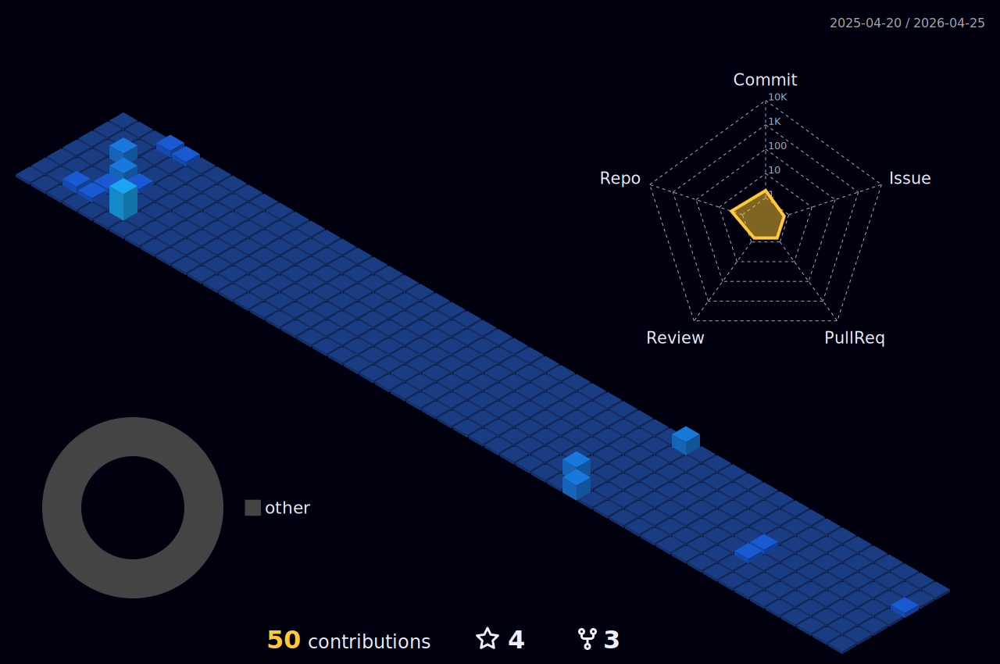

<!-- Animated name -->
<h1 align="center">
  <a>
    !+👋;I'm+Marwah;Computer+and+Informatics+Engineering+Student">
  </a>
</h1>

<!-- Written About Section stuff -->
<pre>🌱 I am currently studying Software Engineering</pre>

<!--  Languages, Frameworks, and Tools -->
## <picture></picture> **Languages, Frameworks, and Tools**

<table>
    <!--  Backend -->
    <tr>
        <td style="font-weight: bold; padding-right: 10px; vertical-align: center; border: none;">Backend:</td>
        <td>
          
          
          
        </td>
    </tr>
    <!--  Frontend -->
    <tr>
        <td style="font-weight: bold; padding-right: 10px; vertical-align: center;">Frontend:</td>
        <td></td>
    </tr>
    <!--  Mobile -->
    <tr>
        <td style="font-weight: bold; padding-right: 10px; vertical-align: center; border: none;">Mobile:</td>
        <td>
          
          
        </td>
    </tr>
    <!--  Database -->
    <tr>
        <td style="font-weight: bold; padding-right: 10px; vertical-align: center; border: none;">Database:</td>
        <td>
          
        </td>
    </tr>
    <!--  Data Science & AI -->
    <tr>
        <td style="font-weight: bold; padding-right: 10px; vertical-align: center; border: none;">Data Science & AI:</td>
        <td>
          
          
          
        </td>
    </tr>
    <!--  Game -->
    <tr>
        <td style="font-weight: bold; padding-right: 10px; vertical-align: center; border: none;">Game:</td>
        <td>
          
        </td>
    </tr>
    <!--  DevOps -->
    <tr>
        <td style="font-weight: bold; padding-right: 10px; vertical-align: center; border: none;">DevOps:</td>
        <td></td>
    </tr>
    <!--  Hosting -->
    <tr>
        <td style="font-weight: bold; padding-right: 10px; vertical-align: center; border: none;">Hosting:</td>
        <td>
          
          
          
          
          
        </td>
    </tr>
    <!--  Version Control -->
    <tr>
        <td style="font-weight: bold; padding-right: 10px; vertical-align: center; border: none;">Version Control:</td>
        <td></td>
    </tr>
    <!--  Other Tool -->
    <tr>
        <td style="font-weight: bold; padding-right: 10px; vertical-align: center; border: none;">Other Tools:</td>
        <td>
          
          
          
          
          
          
        </td>
    </tr>
</table>

---

<!--  Activity Graph -->
<details>
<summary>
<h3 style='display: inline'> 
  <g-emoji class="g-emoji" alias="chart_with_upwards_trend" fallback-src="https://github.githubassets.com/images/icons/emoji/unicode/1f4c8.png">📈</g-emoji>
  <b> WakaTime Stats </b>
</h3>
</summary>

<!--START_SECTION:waka-->

```txt
From: 05 July 2024 - To: 13 July 2024

Total Time: 25 hrs 44 mins

Python           16 hrs 11 mins  ⣿⣿⣿⣿⣿⣿⣿⣿⣿⣿⣿⣿⣿⣿⣿⣶⣀⣀⣀⣀⣀⣀⣀⣀⣀   62.92 %
PHP              3 hrs 54 mins   ⣿⣿⣿⣷⣀⣀⣀⣀⣀⣀⣀⣀⣀⣀⣀⣀⣀⣀⣀⣀⣀⣀⣀⣀⣀   15.21 %
Markdown         2 hrs 37 mins   ⣿⣿⣦⣀⣀⣀⣀⣀⣀⣀⣀⣀⣀⣀⣀⣀⣀⣀⣀⣀⣀⣀⣀⣀⣀   10.22 %
Text             49 mins         ⣷⣀⣀⣀⣀⣀⣀⣀⣀⣀⣀⣀⣀⣀⣀⣀⣀⣀⣀⣀⣀⣀⣀⣀⣀   03.22 %
YAML             47 mins         ⣷⣀⣀⣀⣀⣀⣀⣀⣀⣀⣀⣀⣀⣀⣀⣀⣀⣀⣀⣀⣀⣀⣀⣀⣀   03.09 %
```

<!--END_SECTION:waka-->

---
</details>

<!--  Activity Graph -->
<details>
<summary>
<h3 style='display: inline'> 
  
  <b> Activity Graph </b> 
</h3>
</summary>
<p align="center">
  
</p>

---

</details>

<!--  Dynamic Quotes -->
<details>
<summary>
<h3 style='display: inline'> 📜 Dynamic Quotes </h3>
</summary>
<p align='center'>

</p>
