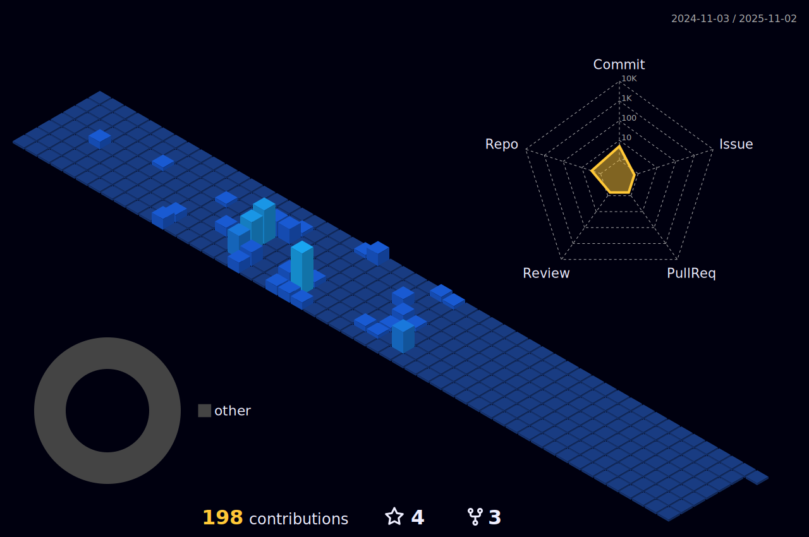

<!-- Animated name -->
<h1 align="center">
  <a>
    !+👋;I'm+Marwah;Computer+and+Informatics+Engineering+Student">
  </a>
</h1>

 <!-- Twitter visitors and badges -->

<!-- Written About Section stuff -->
<pre>🌱 I’m currently learning Software Engineer</pre>

<!--  Languages and Frameworks -->
## <picture></picture> **Languages, Frameworks, and Tools**

<table>
    <tr>
        <td style="font-weight: bold; padding-right: 10px; vertical-align: center; border: none;">Backend:</td>
        <td>
          
          
          
        </td>
    </tr>
    <tr>
        <td style="font-weight: bold; padding-right: 10px; vertical-align: center;">Frontend:</td>
        <td></td>
    </tr>
    <tr>
        <td style="font-weight: bold; padding-right: 10px; vertical-align: center; border: none;">Mobile:</td>
        <td></td>
    </tr>
    <tr>
        <td style="font-weight: bold; padding-right: 10px; vertical-align: center; border: none;">Database:</td>
        <td>
          
          
        </td>
    </tr>
    <tr>
        <td style="font-weight: bold; padding-right: 10px; vertical-align: center; border: none;">Data Science & AI:</td>
        <td>
          
          
      
        </td>
    </tr>
    <tr>
        <td style="font-weight: bold; padding-right: 10px; vertical-align: center; border: none;">DevOps:</td>
        <td></td>
    </tr>
    <tr>
        <td style="font-weight: bold; padding-right: 10px; vertical-align: center; border: none;">Hosting:</td>
        <td>
          
          
        </td>
    </tr>
    <tr>
        <td style="font-weight: bold; padding-right: 10px; vertical-align: center; border: none;">Version Control:</td>
        <td></td>
    </tr>
    <tr>
        <td style="font-weight: bold; padding-right: 10px; vertical-align: center; border: none;">Other Tools:</td>
        <td>
          
          
          
          
        </td>
    </tr>
</table>

---

<summary>

### <g-emoji class="g-emoji" alias="chart_with_upwards_trend" fallback-src="https://github.githubassets.com/images/icons/emoji/unicode/1f4c8.png">📈</g-emoji><b> WakaTime Stats </b>
</summary> 

<!--START_SECTION:waka-->

```txt
From: 05 July 2024 - To: 11 July 2024

Total Time: 17 hrs 3 mins

Python           10 hrs 3 mins   ⣿⣿⣿⣿⣿⣿⣿⣿⣿⣿⣿⣿⣿⣿⣶⣀⣀⣀⣀⣀⣀⣀⣀⣀⣀   58.99 %
PHP              3 hrs 54 mins   ⣿⣿⣿⣿⣿⣶⣀⣀⣀⣀⣀⣀⣀⣀⣀⣀⣀⣀⣀⣀⣀⣀⣀⣀⣀   22.95 %
Text             49 mins         ⣿⣄⣀⣀⣀⣀⣀⣀⣀⣀⣀⣀⣀⣀⣀⣀⣀⣀⣀⣀⣀⣀⣀⣀⣀   04.79 %
YAML             38 mins         ⣿⣀⣀⣀⣀⣀⣀⣀⣀⣀⣀⣀⣀⣀⣀⣀⣀⣀⣀⣀⣀⣀⣀⣀⣀   03.71 %
Blade Template   28 mins         ⣶⣀⣀⣀⣀⣀⣀⣀⣀⣀⣀⣀⣀⣀⣀⣀⣀⣀⣀⣀⣀⣀⣀⣀⣀   02.75 %
```

<!--END_SECTION:waka-->

---

### <b> Activity Graph </b> 
<p align="center">
  
</p>

---

### 📜 Dynamic Quotes 
<p align='center'>

</p>